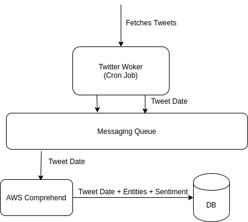

## Finch

Finch is a multi-lingual tweet parsing tool which gives the entities involved in the tweet and the sentiment of the tweet,in addition to all the information provided by the Twitter-API.

### Architecture

<p align="center"></p>

### How to setup

#### Twitter keys

- Make a developers account on twitter and get the access keys and secret tokens for your app.

#### AWS keys

- Create a programmatic user using IAM
- Give the user read/write access to the comprehend service

### How to run

There are 2 methods to run the project

1. Using Docker (Easiest)

- Just edit the `docker-compose.yml` file and add the required keys.

- The images are auto-built and can be found at [Docker Hub](https://hub.docker.com/u/yashmeh)

2. Individual Setup

- Download and install the NATS server, mongoDB and nodeJS (v>=8.x).

- Install dependencies inside comprehend-service and twitter-service using `npm install`.

- Add a `.env` file to the services and add your keys and configurations.

- .env for twitter-service

```
NATS_URL=
CONSUMER_KEY=
CONSUMER_SECRET=
ACCESS_TOKEN=
ACCESS_TOKEN_SECRET=
TAG=<single-tag-you-want-to-follow>

```

- .env for comprehend-service

```
NATS_URL=
ACCESS_KEY=
SECRET_ACCESS=
```

- Run using `node <filename>.js`

- Checkout the database at `http://localhost:5000/api/v1`

### Work Left

[ ] Add exhaustive tests

[ ] Build a GUI to convert this to a CRM tool.

> Finch fetches the tag given in the .env file every 5 minutes and updates the database

### Stargrazers over time

[](https://starchart.cc/YashMeh/finch)
